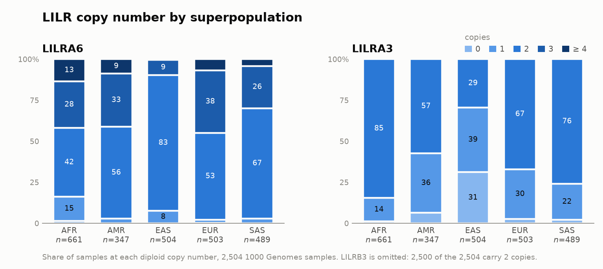

# lilr-wgs

Copy number and phased allele sequences for the 11 **LILR** genes, called from
**short-read whole-genome sequencing** — specifically the 1000 Genomes Project
30× GRCh38 CRAMs.

It is a sibling of [`lilr-genotyper`](https://github.com/avik94ab/lilr-genotyper),
which does the same job from targeted-capture FASTQs at several hundred ×. Almost
every depth-related constant in that pipeline is calibrated to that coverage, and
at 30× those constants stop being filters and become masks: a `DP>=20` variant
filter discards the majority of true heterozygous sites, and a `depth < 15 → N`
consensus mask blanks roughly half of every gene.

So the organising idea here is that **read depth is the subject, not a
parameter**. Every threshold is derived from the sample's own measured coverage,
is aware of the locus's copy number, and is two-sided — because in a cluster of
~90%-identical paralogues, a position at three times the expected depth is a
pile-up of reads that the assignment step failed to separate, and a variant
called there is a paralogous sequence variant wearing a heterozygote's clothes.

See [`PLAN.md`](PLAN.md) for the design and the phase-by-phase build, and
[`docs/`](docs/) for the method notes.

## Status

All nine phases are built, and **copy number** has been scored against assembly
truth. On the 101 donors who have both an HPRC assembly and a 1000 Genomes CRAM,
copy number is **100% correct at LILRB3, 99% at LILRA6 and 95% at LILRA3**
— and five of the six disagreements are the truth set's rather than the
pipeline's, each contradicted by an assay that shares no failure mode with the
one that made the call. `PLAN.md` §9 names every one of them.

The obvious objection is that a donor in that overlap is aligned against a panel
containing its own haplotypes. Rerunning all 101 against donor-excluded panels
reproduced `cn_calls.tsv` byte for byte: recruitment changed, by up to 11% at
LILRB3, but copy number is measured on the CRAM slice against external control
loci before a panel is ever opened, so it cannot be inflated that way. `PLAN.md`
§10 has the numbers. The circularity is real for allele *sequence*, which does
run through recruitment, and that is not yet scored.

Copy number has also been checked against a second, unrelated method, on the
whole collection. [JoGo-LILR](https://doi.org/10.1016/j.humimm.2025.111272)
(Nagasaki et al. 2025) is cohort-relative and reads the LILRB3+LILRA6 pair total
rather than the paralogue-unique window, so it fails differently; across **all
2,504** 1000 Genomes samples the two agree on LILRA6 for **2,497, or 99.7%** —
99.9% on the calls this pipeline reports as confident and 98.7% on the ones it
flags. [`validation/jogo_crosscheck.md`](validation/jogo_crosscheck.md) has the
seven disagreements and the one claim the exercise does *not* support.

The same run reproduces Hardy-Weinberg for the LILRA3 deletion independently in
all 26 populations, at frequencies from 0.08 to 0.76 — a check that needs no
truth set. `PLAN.md` §11.

**Allele sequence is a different matter, and is not yet supported.** Every figure
above is a copy number. The three modules that produce the callable track, the
variant calls and the allele names — `callability.py`, `genotype.py`,
`sequences.py`, 1,023 lines — have no tests, and no output of theirs has been
scored against anything. The code runs and is not stubbed; nothing has checked
whether it is right. [`docs/variant_calling.md`](docs/variant_calling.md) marks
the boundary precisely and sets out what would have to happen to move it.

## What the cohort looks like

<picture>
  <source media="(prefers-color-scheme: dark)" srcset="docs/figures/cn_by_superpopulation-dark.png">
  
</picture>

Both genes vary by ancestry, and **East Asian samples are the outlier in both, in
opposite directions**: 10% carry three or more copies of LILRA6 where every other
superpopulation runs 30–45%, and 31% carry no LILRA3 at all where the others run
1–6%. At CHB and JPT the LILRA3 deletion is the *major* allele, at ~75% — the
"~24% deletion frequency" usually quoted is a European-weighted figure.

Every copy number has its own colour, but the rarest are still only slivers: 11
samples carry no LILRA6 at all — 10 of them African-ancestry — and 36 carry 5 or
6 copies. Regenerate the figure with `scripts/plot_cn_by_superpop.py`.

## Just the copy number, on any cluster

[`portable/lilr_cn.py`](portable/README.md) is the copy-number half of this
pipeline as a single file whose only dependency is `samtools`: no Snakemake, no
conda environment, no scheduler, no panels. It emits the same calls — a drift
test holds every constant and decision in lockstep with `src/lilrwgs/`, and on
the 100-sample cohort both were run against, the two agree on all 300 calls.
Allele sequences still need the full pipeline.

## Why srWGS changes the problem

| | capture (`lilr-genotyper`) | srWGS 30× (here) |
|---|---|---|
| input | whole-readset FASTQ | GRCh38 CRAM, aligned, ALT-aware |
| front end | 11 full-readset bowtie2 passes | one CRAM slice over the LRC |
| duplicates | must **not** be marked — probe geometry, not PCR | already marked; honoured |
| depth baseline | anchor LILR loci inside the same panel | control loci outside the cluster — a genuinely external baseline |
| copy number | cohort GMM, needs ≥30 samples and a DAG barrier | absolute and per-sample; the cohort pass is a refinement |
| depth thresholds | fixed integers | quantiles of a fitted per-copy depth distribution |

The baseline is the deep change. With capture, the only available reference for
"what does one copy look like?" is other LILR genes in the same panel, so copy
number is inherently relative and a cohort has to be called as one batch. With
WGS the answer is measurable from each sample's own genome, so a single sample
can be called on its own.

## The region is difficult, and the difficulties are specific

Three things about the leukocyte receptor complex on chr19q13.42 shape every
design decision, and the code says so where it matters:

1. **LILRA3 is not in the GRCh38 primary assembly.** The reference chromosome
   carries the common ~6.7 kb deletion, so LILRA3 is annotated only on LRC alt
   contigs. Depth over LILRA3 means depth over those contigs at MAPQ 0, plus an
   independent assay at the deletion junction, chr19:54,297,005 — a coordinate
   worth measuring rather than inheriting, since the value this project started
   from was 28 bp off and the assay built on it read zero for every donor alike.
2. **LILRA6 and LILRB3 are ~97% identical where the reads are.** Only the 3'
   ends are paralogue-unique — 2,900 bp and 1,881 bp. Short reads cannot be
   attributed to one gene in the 5' block, so they are kept for both rather than
   competitively discarded, which is what PING does for KIR2DL5A/B.
3. **Nine alt haplotypes are all placed at one primary interval** that contains
   every window used here. ALT-aware alignment makes those windows measurable;
   non-ALT-aware alignment makes every MAPQ-20 count read near zero, which looks
   exactly like a homozygous deletion. The pipeline measures which case it is
   per sample instead of trusting the specification.

## LILRA6 from CRAMs that were not aligned the way we would have aligned them

Everything above reads depth straight out of the alignment the CRAM arrived in,
so every MAPQ-20 number it reports is conditional on that alignment having been
made against GRCh38 *with the `.alt` file*. For the 1000 Genomes 30× set that
holds. Everywhere else it is an assumption, and the coverage model can only
detect that it was violated — turning LILRA6 and LILRB3 into `not_measured` —
never repair it.

`scripts/lilra6_cn.py` repairs it. The LRC and the control loci are pulled out of
whatever alignment they arrived in, converted back to FASTQ, and realigned with
`bwa mem -Y` against the analysis set and its alt index. ALT-awareness becomes a
property of this pipeline, asserted once by the presence of a file, rather than a
property of every input that has to be measured per sample and can only be
refused.

```bash
bash scripts/fetch_t2t_reference.sh          # 3.1 GB + ~50 min to build the index

printf '%s\n' /data/*.final.cram > inputs.txt
python3 scripts/lilra6_cn.py --inputs inputs.txt \
    --target resources/reference/chm13v2.0.fa \
    --reference resources/reference/GRCh38_full_analysis_set_plus_decoy_hla.fa \
    --threads 8 --jobs 4 -o lilr_cn.tsv

TARGET=resources/reference/chm13v2.0.fa \
  qsub -t 1-25 scripts/lilra6_array.sh inputs.txt results/lilr   # or on SGE
```

`--target` is what the reads are realigned to and measured in. `--reference` is
only there to **decode** the input: CRAM stores differences from a reference, so
its bytes cannot be read without one. **BAM input needs no `--reference` at
all**, and neither does a CRAM compressed against the target itself.

| target | genes reported |
|---|---|
| `chm13v2.0.fa` | **LILRA6 and LILRA3** |
| GRCh38 analysis set | LILRA6 only — GRCh38 has no LILRA3 to measure |

`--inputs` is one sample per line, with one, two or three whitespace-separated
columns: the CRAM alone, the CRAM and its index, or an explicit sample name
followed by both. Output is one row per sample, LILRA6 and nothing else.

LILRB3 is still measured internally, because LILRA6's only independent check is
the pooled LILRA6+LILRB3 depth — dropping it would not save a measurement, it
would remove the check. LILRA3 is not measured at all here; see below.

Nothing downstream changed. `coverage.measure` and `cn.call_sample` take a BAM
in GRCh38 coordinates and do not care which aligner produced it, so the copy
number is computed exactly as it is for the CRAM-as-is path — which is what makes
the two comparable, and `validation/compare_realign.py` compares them.

### It reproduces the CRAM-as-is calls

100 samples already called from their CRAMs, recalled through extract-and-realign
and scored against those calls. Same reads, same index, same copy-number code;
one step differs.

| gene | integer agreement | median Δestimate | worst Δ |
|---|---|---|---|
| **LILRA6** | **100/100 (100%)** | +0.0000 | 0.0030 |
| LILRB3 (measured, not reported) | 100/100 (100%) | +0.0000 | 0.0010 |

Every call `measured`, every sample `alt_aware`, nothing refused. This is a
plumbing test rather than a validation: the realignment targets the index the
input was aligned against, so what it rules out is that extraction, collation,
re-pairing or singleton handling lost reads — not that the pipeline works on an
input aligned to something else. Against truth, `validation/` remains the score.
PLAN.md §12 has the detail.

**LILRA3, on CHM13.** GRCh38 cannot measure it at all — its chr19 carries the
deletion, so LILRA3 lives only on alt contigs and has to be read as MAPQ-0 depth
across four near-identical haplotypes, a route that cannot survive a regional
extraction. CHM13 carries the insertion allele, so there it is an ordinary
MAPQ-20 measurement like any other gene, and scores **100/100** against the
CRAM-as-is calls with estimates landing at 0.000 / 0.988 / 2.003 for true copy
numbers 0 / 1 / 2. PLAN.md §14.

The window is the sequence that is **deleted and mappable** — 4,817 bp, the
intersection of the 6.7 kb deletion with the gene body. Both halves are
load-bearing, and getting either wrong produces plausible copy numbers rather
than errors: the gene alone floors a homozygote at 0.65, because 2.3 kb of the
gene survives the deletion; the deletion alone drags a two-copy sample to 1.70,
because its last 1.9 kb is Alu-derived breakpoint flank that reads near-zero at
MAPQ 20 in everyone.

Two further limits. The extraction is only as complete as the alignment it
reads from, so a read the input aligner put outside these intervals is not there
to be rescued; and duplicates remain the input's judgement, excluded on the flags
that arrive and never recomputed, because duplicate detection needs the whole
library and a 550 kb slice is not it. A GRCh37 input is **refused**, not
lifted: chromosome 19 carries the same name in both assemblies, so extracting
anyway would return a different half-megabase and call copy number on whatever
lives there.

## From copy number to allele sequence

Copy number is the measurement this pipeline has validated. What follows it —
calling the variants and assembling one sequence per haplotype — is built and
**not yet verified**; see the caveat at the end of this section and
[`docs/variant_calling.md`](docs/variant_calling.md) for exactly where the line
falls.

Taking copy number as given, the remaining problem is that the LILR genes are too
similar for a read to say which one it came from. Three decisions follow, and all
three are borrowed rather than invented.

### Remove and rescue, not remove

Reads are aligned against all eleven genes' panels, and each **pair** is scored by
its summed alignment score. A pair goes to its single best gene. A pair within
`--buffer` (default 2) of the best is cross-mapped, and the question is what to do
with it.

Discarding it is the obvious move and it is wrong. LILRA6 and LILRB3 share a
~4.6 kb block with no gene-diagnostic 31-mers; LILRB1 and LILRB4 are ~92%
identical across the cytoplasmic tail. In those blocks the tie is a **property of
the genes**, not a defect of the read, and a competitive discard removes the block
from both genes at once — 26% of the LILRB3 CDS in the capture cohort.

So a tie confined to one `shared_group` is **kept in every tied gene** and tagged
with how many genes claimed it. This is the *remove and rescue* pattern from
[PING](https://github.com/Hollenbach-lab/PING), which comments out the negative
filter for KIR2DL5A/B and shares one reference between them for the same reason,
and it is ported from `lilr-genotyper`'s `filter_crossmapped.py` — where measuring
the LILRA6/LILRB3 pair showed **99.87% of ties have a margin of exactly zero**,
confirming the drop-on-tie policy was the defect rather than the buffer width.

The verdict has to be written to `shared_pairs.tsv` rather than left in a BAM tag,
because reads are recruited against a pangenome panel and called against a single
reference, so a FASTQ sits between the two and tags do not survive it. The
predecessor lost the information there.

### Insufficient depth is a reported state, not a silent gap

This is where the pipeline differs most from its predecessors, and it is the same
argument as the copy-number path: **there is no fixed depth constant.**

A position at copy number *k* is modelled as NB(*k*·λ₁, *k*·*r*), and the floor is

```
floor = max( k·λ₁ − z·σ ,  MIN_READS_PER_COPY × k )     α = 0.005
```

— the greater of a distributional bound and a per-haploid-copy minimum, both
scaled by the locus's own copy number and by λ₁ measured in that same sample.
At λ₁ ≈ 18 that is 21 reads at CN 2 under Poisson and 11 under real
overdispersion, against the `DP >= max(20, 10·CN)` the predecessor applies
regardless of coverage. At 30× a fixed 20 is not a filter, it is a mask over half
the data — and not a random half, but the GC-extreme, paralogue-adjacent and
repeat-flanked positions, which is where LILR genotypes actually differ.

The gate is **two-sided**. A position at three times expected depth is an
unseparated paralogue pile-up, and a heterozygote called there is a paralogous
sequence variant wearing a heterozygote's clothes. `effective_copies()` keeps that
ceiling from backfiring on the shared blocks, where reads are legitimately counted
in both genes and the expectation is the pair's combined copy number.

What happens to a position that fails:

| | |
|---|---|
| it is excluded from `callable.bed` | so `HaplotypeCaller -L` never considers it, and the consensus and the variant call agree by construction rather than by two thresholds that can disagree |
| the consensus base is masked to `N` | via `mask_sequence()` |
| **the reason is recorded** | `low_depth`, `high_depth`, `low_mapq`, `paralog_ambiguous`, `no_model` |

That last row is the point. The predecessor masked to a bare `N`, so an `N` in its
output could equally mean "no reads", "reads but ambiguous", or a real deletion.
Distinguishing those has more diagnostic value than the mask itself, and
`callable_fraction` per (sample, gene) is what tells you whether a gene was
*measured* or merely *not contradicted*.

kir-mapper's documentation makes the complementary point from the other
direction: its intron mode reports apparent novel alleles that are artifacts of
repetitive regions. An allele call is only as good as the callability of the
positions that distinguish it, which is why a sequence claim here requires every
distinguishing position to be `ok` in the track — not merely non-`N`.

### Status of this half

The code exists and is not stubbed — `HaplotypeCaller` at `-ploidy` = copy number
restricted to the callable track, `whatshap phase`/`polyphase` above CN 2,
`bcftools consensus` per haplotype, then CDS/cDNA/protein. But `callability.py`,
`genotype.py` and `sequences.py` carry no tests, and no allele sequence has been
scored against truth. **Every accuracy figure quoted in this README is a copy
number.** `docs/variant_calling.md` sets out what would have to happen to change
that, and in what order.

## Requirements

```bash
micromamba create -y -f environment.yml && micromamba activate lilr-wgs
bash scripts/check_env.sh          # asserts samtools has libcurl, the .alt, etc.
```

`samtools` **must** be built with libcurl — reading CRAMs over HTTPS is the
front end. The check script fails loudly if it is not, because without it the
failure surfaces as a bare "fail to open file" that reads like a bad path.

`{reference}.alt` must be beside the bwa index for the realignment path. `bwa`
gives no error when it is missing; it simply aligns without ALT-awareness, and
every MAPQ-20 window in the LRC then reads near zero for every sample alike. The
check script warns, and `lilra6_cn.py` refuses to report a number rather than
reporting zero.

## Provenance

- Cross-mapping arbitration, the HPRC gene panels and the sequence builder come
  from `lilr-genotyper`.
- The GRCh38 coordinates, the LILRA3 junction assay and the ALT-awareness
  diagnostic come from `lilrCN_aou`, all re-measured against the 101-donor
  overlap before being relied on.
- The extractor pattern, ratio-to-a-reference-locus copy number with a
  human-overridable threshold file, and the precedent for not competitively
  filtering an inseparable paralogue pair come from
  [PING](https://github.com/Hollenbach-lab/PING) (Hollenbach lab), which
  comments out the negative filter for KIR2DL5A/B and shares one reference
  between them.
- The paired-score cross-map arbitration with `shared_group` rescue is ported
  from [`lilr-genotyper`](https://github.com/avik94ab/lilr-genotyper)'s
  `filter_crossmapped.py`, including the `ZS:i:<n_tied>` tag that records how
  many genes claimed a rescued pair.
- [kir-mapper](https://github.com/erickcastelli/kir-mapper) is the cautionary
  case for the allele-naming half: its intron mode reports apparent novel
  alleles that are artifacts of repetitive regions, which is why a sequence
  claim here requires the distinguishing positions to be `ok` in the
  callability track rather than merely non-`N`.
